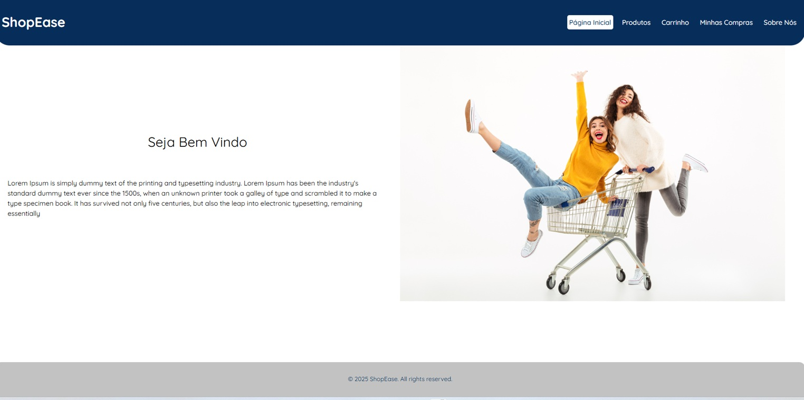
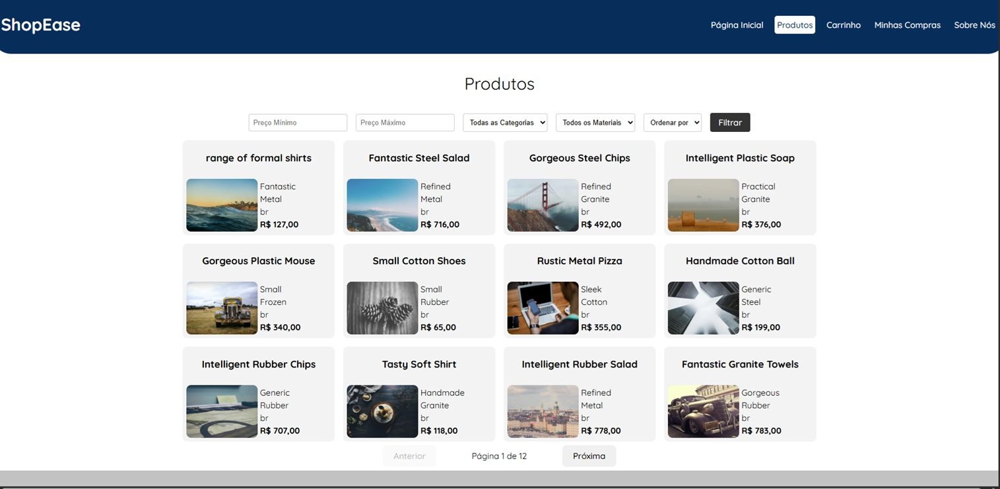
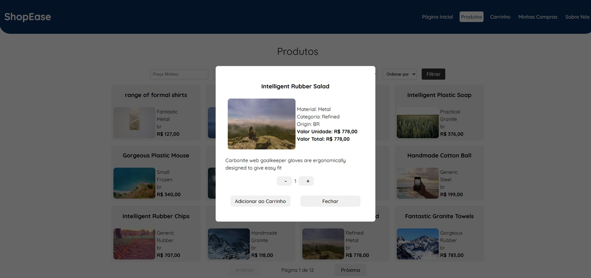
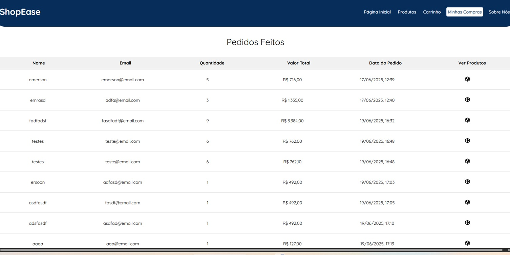
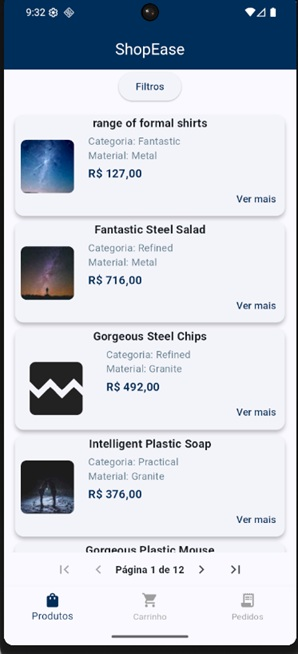
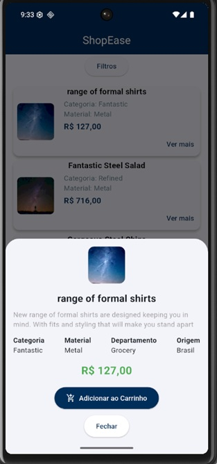
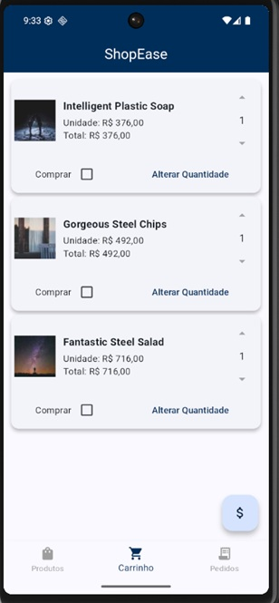
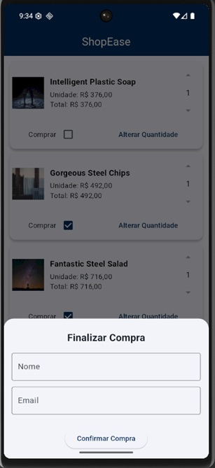
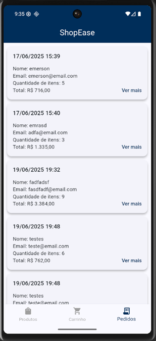
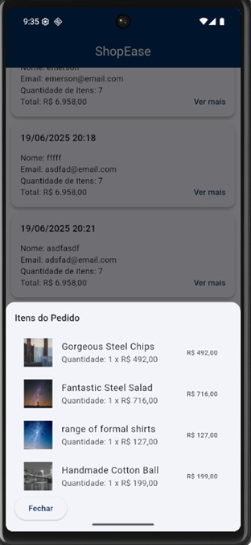

# 🚀 Projeto Full Stack Jr - Teste Técnico

Este projeto contém três aplicações:

- 📦 **Backend (NestJS)**
- 🌐 **Frontend Web (React)**
- 📱 **Mobile (Flutter)**

---

## 📁 Estrutura do projeto

```
/backend
/react
/flutter_app
```

Cada pasta contém um projeto separado com suas próprias dependências.

---

## ⚙️ Como rodar o projeto

### 📦 Backend - NestJS

1️⃣ Acesse a pasta:

```bash
cd backend
```

2️⃣ Instale as dependências:

```bash
npm install
```

3️⃣ Execute o servidor:

```bash
npm run start:dev
```

⚠️ **Requisitos:**

- Node.js (versão LTS recomendada)
- NestJS CLI (opcional, mas recomendado):
  ```bash
  npm i -g @nestjs/cli
  ```

---

### 🌐 Frontend - React

1️⃣ Acesse a pasta:

```bash
cd frontend
```

2️⃣ Instale as dependências:

```bash
npm install
```

3️⃣ Rode o projeto:

```bash
npm run dev
```

⚠️ **Requisitos:**

- Node.js

---

### 📱 Mobile - Flutter

1️⃣ Acesse a pasta:

```bash
cd flutter_app
```

2️⃣ Instale as dependências:

```bash
flutter pub get
```

3️⃣ Rode o app:

```bash
flutter run
```

⚠️ **Requisitos:**

- Flutter SDK instalado ([Guia oficial](https://docs.flutter.dev/get-started/install))

---

## 💡 Observações

- O backend deve estar rodando antes de testar o React ou o Flutter.
- As URLs e portas usadas podem ser ajustadas no código conforme necessário (por padrão o NestJS roda em `http://localhost:3000`).
- O Flutter deve ser rodado no emulador para acessar diretamente o localhost.
- Por padrão, o react roda em http://localhost:5173/
- Certifique-se de que o dispositivo ou emulador do Flutter está configurado corretamente antes de rodar o app mobile.

##  

##  

##      
